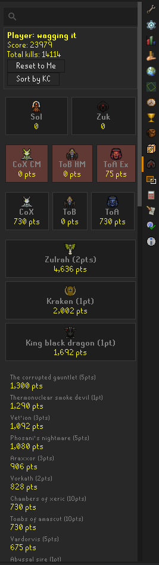

# PvM Score plugin
A Runelite plugin that calculates a score based off of player's bossing Hiscores.

Adds these scores to the player right-click menu, and adds 
a plugin panel that displays the boss hiscores of the user you have clicked on. 




The score algorithm will be tweaked based off of feedback.

For now, the following bosses will award the specified number of points per kill.

```
50 Points: 
TZKAL_ZUK
SOL_HEREDIT

25 Points: 
CHAMBERS_OF_XERIC_CHALLENGE_MODE
THEATRE_OF_BLOOD_HARD_MODE 
TOMBS_OF_AMASCUT_EXPERT

10 Points: 
CHAMBERS_OF_XERIC 
THEATRE_OF_BLOOD
TOMBS_OF_AMASCUT

5 Points:
TZTOK_JAD
THE_WHISPERER
DUKE_SUCELLUS
THE_LEVIATHAN
VARDORVIS
YAMA
PHOSANIS_NIGHTMARE
THE_CORRUPTED_GAUNTLET
DOOM_OF_MOKHAIOTL
NEX

3 Points:
CALLISTO
VENENATIS
VETION
THE_GAUNTLET
PHANTOM_MUSPAH
ARAXXOR
NIGHTMARE,
CORPOREAL_BEAST

2 Points:
ZULRAH
VORKATH
ALCHEMICAL_HYDRA

1 Point:
ABYSSAL_SIRE, AMOXLIATL, ARTIO, 
BARROWS_CHESTS, BRYOPHYTA, CALVARION 
CERBERUS,CHAOS_ELEMENTAL, CHAOS_FANATIC, COMMANDER_ZILYANA
CRAZY_ARCHAEOLOGIST, DAGANNOTH_PRIME, DAGANNOTH_REX
DAGANNOTH_SUPREME, DERANGED_ARCHAEOLOGIST, GENERAL_GRAARDOR
GIANT_MOLE, GROTESQUE_GUARDIANS, HESPORI
KALPHITE_QUEEN, KING_BLACK_DRAGON, KRAKEN
KREEARRA, KRIL_TSUTSAROTH, LUNAR_CHESTS
MIMIC, OBOR, SARACHNIS
SCORPIA, SCURRIUS, SHELLBANE_GRYPHON
SKOTIZO,SPINDEL, TEMPOROSS, 
THE_HUEYCOATL,THE_ROYAL_TITANS, THERMONUCLEAR_SMOKE_DEVIL
WINTERTODT, ZALCANO
```
